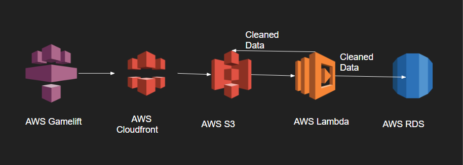

# GameLift monitor tool:

  This tool will monitor the events happening with gamelift and created cleaned data based on the logs in S3. 
  
  This is hosted on AWS lambda and runs as a daily cron job. I have a student account with AWS and can have server in only one region, But
  the tool can be easily extended to multiple regions.
  
  # Data flow: 
  
  
